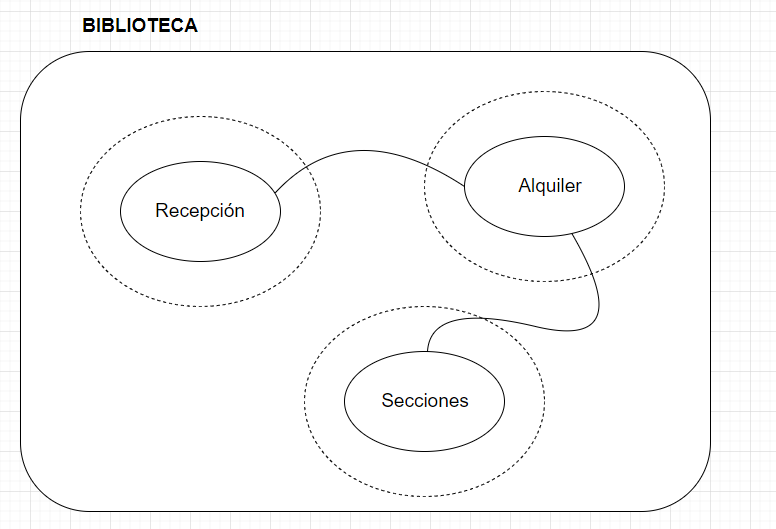
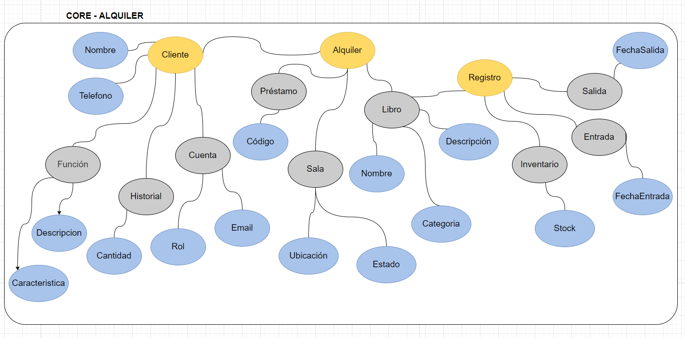
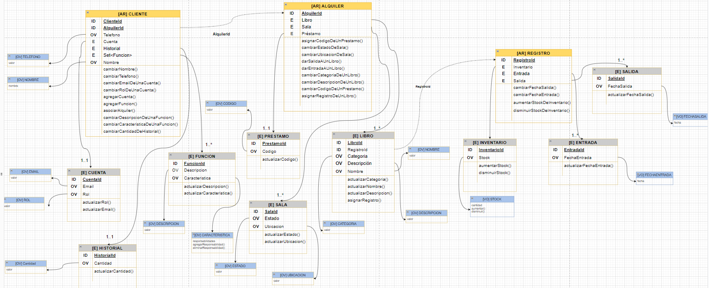
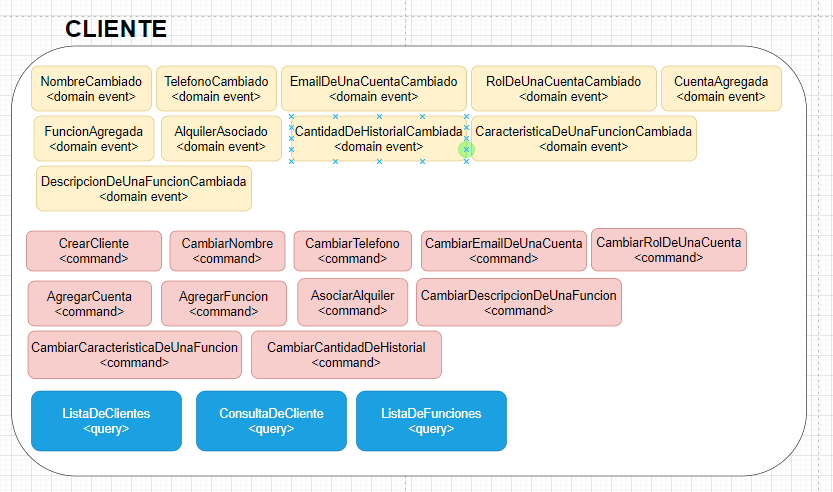
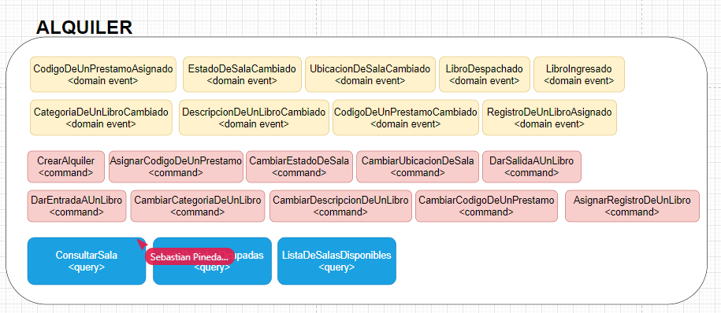
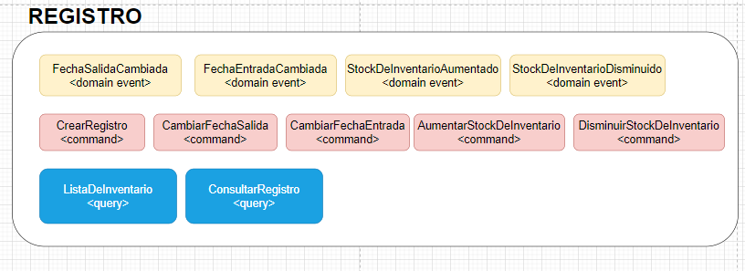

# Reto-DDD-Final
Se crea un proyecto basado en el servicio de alquiler de una biblioteca, se implemento la parte  estrategica y tactica de dicho dominio.

### Artefactos

<ul>
<li>Análisis del problema (big piture y contexto delimitado seleccionado). </li>
<li>Modelo de dominio, con los agregados, comportamientos, entidades y objetos de valor y casos de uso.</li>
</ul>

### Link del diagrama del dominio

https://app.diagrams.net/#G1x6E9_EPyKxhgPp-htQdxoJhsbLsPOT1l

## Análisis 

## Modelo de dominio

## Eventos

